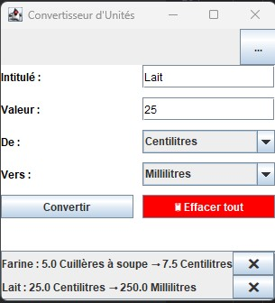

# Converteur d'unités

Ce projet Java propose une interface (swing) simple pour convertir des unités courantes : distance, poids, quantité, température, etc.  
L'utilisateur peut choisir un type d’unité, entrer une valeur, et obtenir automatiquement la conversion.

Il est également possible d’ajouter un libellé personnalisé pour chaque conversion. L'information est conservée dans l’historique, jusqu’à suppression manuelle ou réinitialisation complète.  

## Aperçu de l'application

L'image ci-dessus montre l'interface du convertisseur, avec un exemple concret de conversion.

## Fonctionnalités
- Interface graphique intuitive en Java (Swing)
- Conversion entre différentes unités :
  - Températures (Celsius  <-> Fahrenheit)
  - Distance (kilomètres <-> miles)
  - Poids (kilogrammes <-> livres)
- Validation des données
- Résultat affiché en temps réel

## Défis rencontrés
- Créer un système de conversion flexible et extensible
- Gérer l'historique avec suppression individuelle ou totale
- Garantir une interface simple tout en intégrant plusieurs types de conversion

## Technologies utilisées

  
  
  

